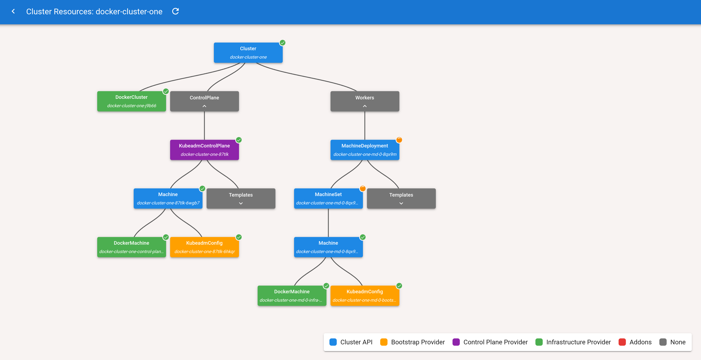

# Cluster API visualizer

[Cluster API visualizer](https://github.com/Jont828/cluster-api-visualizer) is an Open Source project from Jonathan Tong. The Cluster API visualizer is deployed into a management cluster and provides a great visual overview over workload clusters. This makes Cluster API significantly more accessible and it's a lot easier to understand dependencies between Cluster API objects.

Deploy the Cluster API visualizer via:

```bash
helm install capi-visualizer ./yamls/visualizer/chart/cluster-api-visualizer -n observability --create-namespace --values ./yamls/visualizer/values.yaml
```

Open a port-forward to the UI:

```bash
kubectl port-forward -n observability svc/capi-visualizer 18081:8081
```

Access the UI via your browser under [http://localhost:18081](http://localhost:18081).

Explore your workload cluster(s)!



## Changing Cluster Topology

Now we're ready to explore more of the power of Cluster API, [let's first explore cluster topology](cluster-topology.md)!
